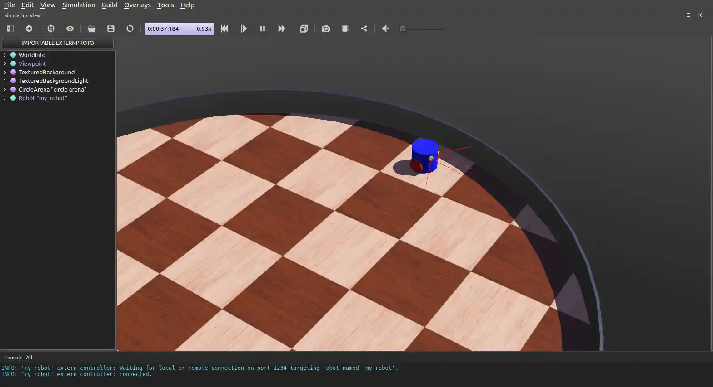

# ROS2 Webots

## Simulating an Obstacle Avoiding Robot

> Excerpt from [ROS 2 Documentation (IRON)](https://docs.ros.org/en/iron/index.html): The Robot Operating System (ROS) is a set of software libraries and tools for building robot applications. From drivers and state-of-the-art algorithms to powerful developer tools, ROS has the open source tools you need for your next robotics project.

### Related Articles

* [ROS2 (+ Gazebo) Installation](https://mpolinowski.github.io/docs/Automation_and_Robotics/Robotics_Simulation/2023-11-19--ros2-gazebo-installation/2023-11-19)
* [ROS2 Graph Concepts](https://mpolinowski.github.io/docs/Automation_and_Robotics/Robotics_Simulation/2023-11-24--ros2-graph/2023-11-24)
* [ROS2 Gazebo Robot Simulation](https://mpolinowski.github.io/docs/Automation_and_Robotics/Robotics_Simulation/2023-11-26--ros2-gazebo-simulation/2023-11-26)
* [ROS2 Webots Robot Simulation](https://mpolinowski.github.io/docs/Automation_and_Robotics/Robotics_Simulation/2023-11-26--ros2-webots/2023-11-26)

